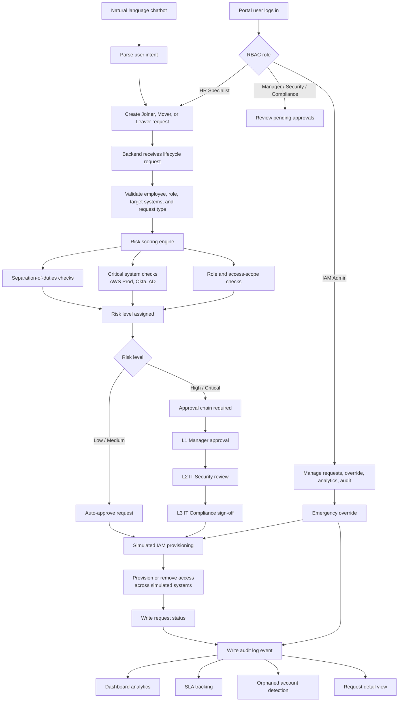

# IdentityFlow

IdentityFlow is a self-service identity lifecycle automation demo for IT and security teams. It models Joiner, Mover, and Leaver workflows with approvals, risk scoring, simulated IAM provisioning, audit logs, and a lightweight web portal.

The project is intentionally simulation-first: no real production systems are connected. It is designed to show how identity access workflows can be automated safely before integrating with tools such as Okta, GitHub, Slack, AWS, Jira, or Active Directory.

## Why It Exists

Manual identity operations create delays and security risk:

- New hires wait for access across multiple systems
- Role changes leave stale permissions behind
- Offboarding can miss accounts and create orphaned access
- Approvals are difficult to audit after the fact

IdentityFlow demonstrates a cleaner lifecycle:

```text
request -> risk score -> approval chain -> simulated provisioning -> audit trail
```

## Workflow



### Workflow Summary

1. A portal user logs in with a role such as HR, manager, security, compliance, or IAM admin.
2. HR users can create Joiner, Mover, or Leaver lifecycle requests.
3. The backend validates the request, target employee, role mapping, and requested systems.
4. The risk engine checks separation-of-duties issues, critical systems, and access scope.
5. Low and medium risk requests can be auto-approved.
6. High and critical requests move through manager, security, and compliance approval levels.
7. Approved requests trigger simulated IAM provisioning across enterprise systems.
8. Every major action writes to the audit log, which supports analytics, SLA tracking, orphan detection, and request history.

## Features

- Joiner, Mover, and Leaver workflow automation
- Multi-level approval chain for higher-risk requests
- Risk scoring with separation-of-duties checks
- Emergency override with audit logging
- Role-based access control for portal users
- Natural language request chatbot
- SLA tracking for pending approvals
- Orphaned account detection
- Analytics dashboard
- Simulated IAM calls across common enterprise systems

## Simulated Systems

IdentityFlow models access across:

```text
GitHub, Jira, Confluence, Slack, AWS Dev, AWS Prod, PagerDuty,
Datadog, Okta, VPN, SIEM, MDM, Active Directory, HR System
```

## Supported Employee Roles

```text
Software Engineer, Senior Software Engineer, DevOps Engineer,
Site Reliability Engineer, Security Analyst, Engineering Manager,
IT Administrator, Data Engineer, Product Manager, Intern
```

## Tech Stack

- Backend: Python, Flask, Flask-CORS
- Frontend: HTML, CSS, JavaScript
- Charts: Chart.js
- Data: JSON files for demo persistence
- Deployment-ready backend config for Render

## Project Structure

```text
IdentityFlow/
|-- backend/
|   |-- app.py
|   |-- workflows.py
|   |-- iam_simulator.py
|   |-- risk.py
|   |-- chatbot.py
|   |-- demo_seed.py
|   |-- requirements.txt
|   |-- render.yaml
|   `-- data/
|       |-- users.json
|       |-- roles.json
|       |-- requests.json
|       |-- rbac.json
|       `-- audit_log.json
`-- frontend/
    |-- index.html
    |-- style.css
    |-- app.js
    |-- config.js
    `-- _redirects
```

## Quick Start

Clone the repository:

```bash
git clone https://github.com/chandra23225/IdentityFlow.git
cd IdentityFlow
```

Install backend dependencies:

```bash
cd backend
python -m pip install -r requirements.txt
```

Seed demo data:

```bash
python demo_seed.py
```

Start the Flask API:

```bash
python app.py
```

Open a second terminal and serve the frontend:

```bash
cd frontend
python -m http.server 8080
```

Open:

```text
http://localhost:8080
```

## Demo Accounts

| Username | Password | Role | Access Level |
|---|---|---|---|
| `admin001` | `admin123` | IAM Administrator | Full access and emergency override |
| `mgr001` | `manager123` | Engineering Manager | L1 approvals |
| `sec001` | `security123` | IT Security | L2 approvals |
| `comp001` | `itadmin123` | IT Compliance | L3 approvals |
| `hr001` | `hr123` | HR Specialist | Create requests only |

These credentials are demo-only and should not be used in production systems.

## Approval Flow

Low and medium risk requests can be auto-approved. High and critical requests move through the approval chain:

```text
Request submitted
        |
        v
Risk score calculated
        |
        +-- Low/Medium -> auto-approved -> IAM provisioned
        |
        +-- High/Critical
                |
                v
        L1 Manager approval
                |
                v
        L2 IT Security review
                |
                v
        L3 IT Compliance sign-off
                |
                v
        IAM provisioned across simulated systems
```

Critical systems such as `AWS_Prod`, `Okta`, and `AD` always require all three approval levels.

## API Reference

| Method | Endpoint | Description |
|---|---|---|
| `GET` | `/health` | Health check |
| `POST` | `/rbac/login` | Authenticate portal user |
| `GET` | `/rbac/users` | List portal users and role definitions |
| `GET` | `/users` | List employees |
| `GET` | `/users/:id` | Get employee details |
| `GET` | `/roles` | List role-to-system mappings |
| `POST` | `/joiner` | Submit onboarding request |
| `POST` | `/mover` | Submit role-change request |
| `POST` | `/leaver` | Submit offboarding request |
| `GET` | `/requests` | List lifecycle requests |
| `GET` | `/requests/:id` | Get request details |
| `POST` | `/requests/:id/approve` | Approve an approval level |
| `POST` | `/requests/:id/reject` | Reject a request |
| `POST` | `/requests/:id/override` | Emergency override |
| `GET` | `/audit` | View audit log |
| `GET` | `/analytics` | Dashboard analytics |
| `GET` | `/orphans` | Detect orphaned accounts |
| `GET` | `/sla` | View SLA status |
| `POST` | `/chat` | Submit natural language request |
| `POST` | `/risk/score` | Score request risk |

## Deployment Notes

The backend includes `backend/render.yaml` for Render-style deployment. The frontend can be hosted separately as a static site, but `frontend/config.js` should be updated with the deployed backend URL.

## MVP Scope

IdentityFlow is a demo application. It uses JSON files for persistence and simulated IAM adapters. A production version would need real authentication, secrets management, database persistence, audit retention policies, and hardened IAM integrations.

## License

MIT
